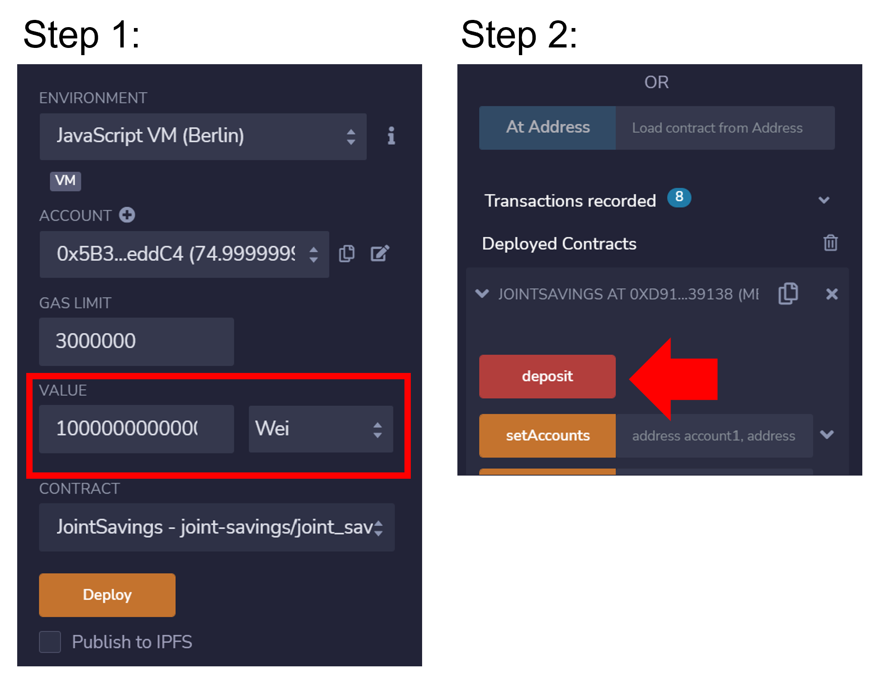
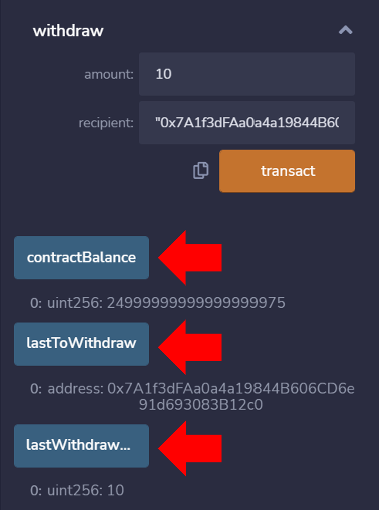

# Ethereum-Based Joint Savings Account 🪙

- Two-wallet address savings account deployed on Javascript VM using the Remix IDE

## Source Code 🔍

[Code for joint savings account](joint_savings.sol)

[Screenshots of contract functionality](Execution_Results)

## Here's How it Works👇

## Set Accounts

Use the following dummy accounts, or create new, dummy addresses on the [Vanity-ETH](https://vanity-eth.tk/):

Dummy account1:
> address: 0x0c0669Cd5e60a6F4b8ce437E4a4A007093D368Cb

Dummy account2:
> address: 0x7A1f3dFAa0a4a19844B606CD6e91d693083B12c0

Use the `setAccounts` function to define the authorized Ethereum address that will be able to withdraw funds from the smart contract:

- Enter wallet addres for `account1` and `account2`
- Hit the `transact` button

## Deposit Funds

Test the smart contract's `deposit` functionality:

- Enter deposit amount in the `value` field
- Click `deposit` button

Verify transaction in log:

## Check Account Balance

Use the `contractBalance` function to verify that the funds were added to the contract:

Verify transaction in log:

## Withdraw Funds

Test the contract's withdrawal functionality:

- Enter the withdrawal `amount` and `recipient` account address
- Click on the `transact` button

Verify transaction in log:

Use the `lastToWithdraw` and `lastWithdrawAmount` functions to verify withdrawals:

## Useful Links 🆘

Remix Project: https://remix-project.org/
